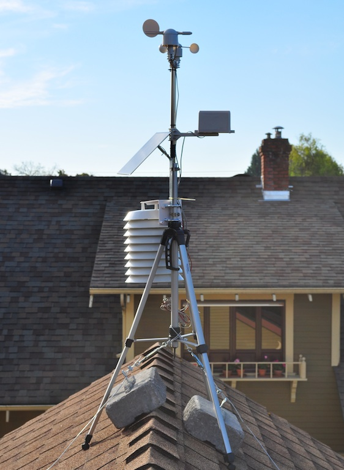
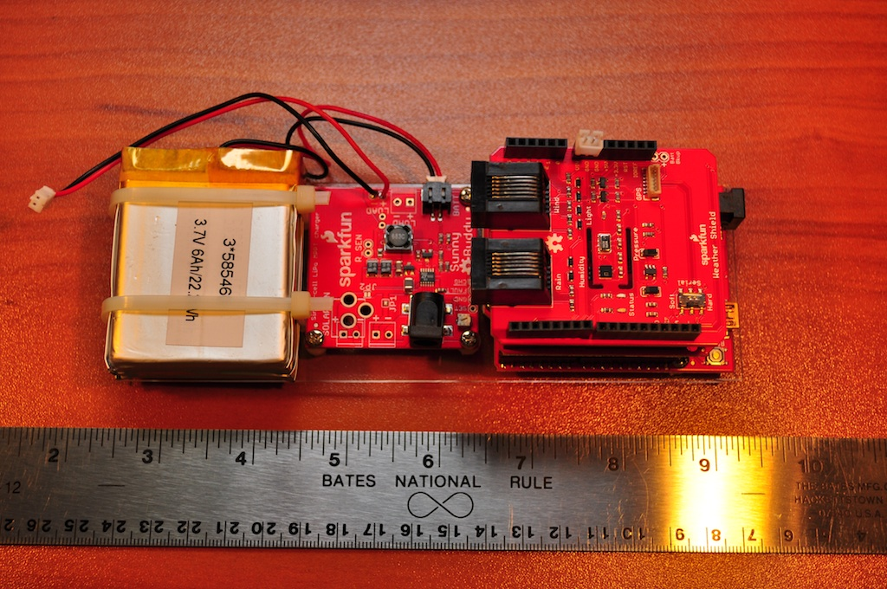

<html>
<body>
<h4>Do-it-yourself Weather Station</h4>

Building a do-it-yourself (DIY) weather station is an exciting way to learn about the "Internet of Things".  What follows is a detailed project description on how to build your own DIY weather station using low cost, easily available parts, for about $350.  Virtually all the hardware and software used in this project is "open source", allowing great latitude in customizing the weather station to suit your individual needs and application.

Building the weather station will give you an excellent introduction to a variety of technologies.  You will learn about programming Arduino micro-controllers, assembling electronic components, and using solar energy to power your project.  You will learn about Linux server software systems and architecture, scripting for Internet applications, and displaying information in a web page.

You can find all the required software available under open source, GNU license at this project site.  Please read the <a href="server_model/docs/DIY Weather Project Description.pdf">project description document</a> for details on procuring the materials, assembling the weather station and installing the software.

 
<b>Weather station, anchored with heavy bricks, deployed on the roof.</b>
  
 
<b>Weather station electronics assembly slides into solar shield housing.</b>
  
 
<b>Weather station data displayed on web page.</b>
 
</body>
</html>
